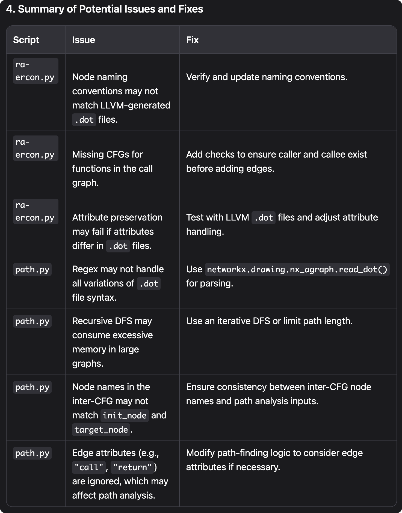

# From .bc file to cfg and Static Path

## 1 Basic logic

1. Install llvm and clang.
2. Generate intra-cfg from built-in.bc.

   ```sh
   opt -passes='dot-cfg' built-in.bc
   ```

3. Generate cal-graph from built-in.ll

   ```sh
   opt -passes='dot-callgraph' built-in.ll
   ```

4. Generate inter-cfg through intra-cfg and call graph using ra-er.py
5. Generate path from inter-cfg for analysis using path.py.

## 2 Remark

1. You may need create a vritual.
2. You may need to specify the graph of the path in the script
3. Here is the potential issue detected by llm >_^\ \.
   